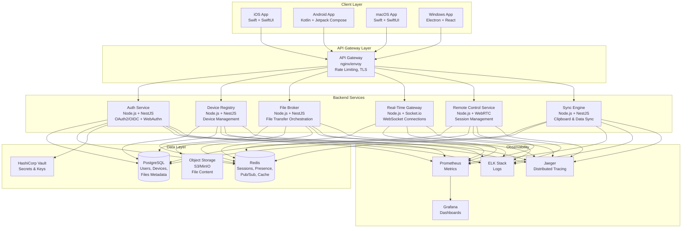
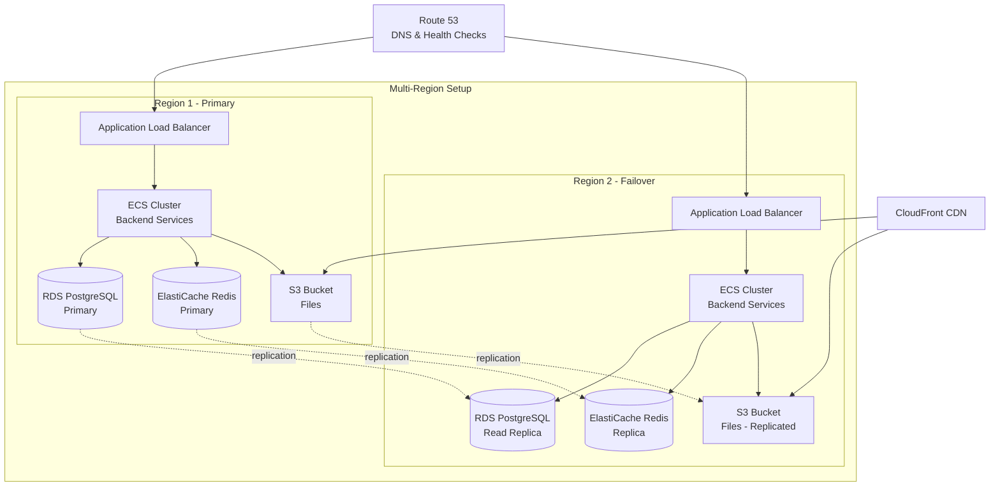

# Universal Device Connector - System Architecture

## Executive Summary

The Universal Device Connector is a production-ready cross-platform application that enables seamless synchronization and control across iOS, Android, macOS, and Windows devices. The system provides secure file sharing, clipboard sync, remote device control, and unified device management through a sleek, Google-inspired UI.

## High-Level Architecture

## Component Responsibilities

### Client Applications

#### iOS App (Swift + SwiftUI)
- **Responsibilities:**
  - Native iOS UI with SwiftUI
  - Face ID / Touch ID integration via LocalAuthentication framework
  - Clipboard access via UIPasteboard
  - File system access within app sandbox and via document picker
  - Background task management for sync
  - Push notification handling
  - Network communication with backend services

- **Key Integrations:**
  - LocalAuthentication for biometrics
  - Network framework for efficient networking
  - Keychain Services for secure credential storage
  - CloudKit for optional iCloud integration
  - AVFoundation for remote control screen capture (where permitted)

#### Android App (Kotlin + Jetpack Compose)
- **Responsibilities:**
  - Native Android UI with Jetpack Compose
  - Fingerprint / Face unlock via BiometricPrompt API
  - Clipboard access via ClipboardManager
  - File system access via Storage Access Framework
  - Background services and WorkManager for sync
  - Firebase Cloud Messaging for push notifications
  - Network communication with backend services

- **Key Integrations:**
  - BiometricPrompt for biometrics
  - Retrofit/OkHttp for networking
  - EncryptedSharedPreferences for secure storage
  - MediaProjection API for remote control screen sharing (with user consent)
  - WorkManager for background tasks

#### macOS App (Swift + SwiftUI)
- **Responsibilities:**
  - Native macOS UI with SwiftUI
  - Touch ID integration
  - Full file system access (with user permissions)
  - Clipboard access via NSPasteboard
  - System-level integrations (status bar, notifications)
  - Remote control input handling

- **Key Integrations:**
  - LocalAuthentication for Touch ID
  - FileManager for file operations
  - NSWorkspace for system integration
  - ScreenCaptureKit for remote control (macOS 12.3+)

#### Windows App (Electron + React)
- **Responsibilities:**
  - Cross-platform UI using React
  - Windows Hello integration via Web Authentication API
  - File system access via Node.js fs module
  - Clipboard access via Electron clipboard API
  - System tray and notifications
  - Remote control via native modules

- **Key Integrations:**
  - Electron IPC for main/renderer communication
  - Native Node.js modules for system integration
  - Windows Hello via WebAuthn
  - node-screenshot-desktop for remote control

### Backend Services

#### Auth Service
- **Responsibilities:**
  - User registration and authentication
  - OAuth2/OIDC provider integration (Google, Apple)
  - WebAuthn/Passkey support for passwordless auth
  - Token issuance (JWT access + refresh tokens)
  - Token validation and refresh
  - Multi-device authentication flow
  - Biometric approval coordination

- **APIs:**
  - `POST /auth/register` - User registration
  - `POST /auth/login` - Email/password login
  - `POST /auth/oauth/google` - Google OAuth flow
  - `POST /auth/oauth/apple` - Apple OAuth flow
  - `POST /auth/webauthn/register` - WebAuthn registration
  - `POST /auth/webauthn/authenticate` - WebAuthn authentication
  - `POST /auth/token/refresh` - Refresh access token
  - `POST /auth/biometric/request` - Request biometric approval
  - `POST /auth/biometric/respond` - Respond to biometric request
  - `POST /auth/logout` - Logout and revoke tokens

#### Device Registry
- **Responsibilities:**
  - Device registration and management
  - Device capability tracking (OS, version, features)
  - Device presence management
  - Device authorization and revocation
  - Device-to-device trust relationships

- **APIs:**
  - `POST /devices/register` - Register new device
  - `GET /devices` - List user's devices
  - `GET /devices/:id` - Get device details
  - `PUT /devices/:id` - Update device info
  - `DELETE /devices/:id` - Remove device
  - `POST /devices/:id/trust` - Trust another device
  - `DELETE /devices/:id/trust/:targetId` - Revoke trust

#### File Broker
- **Responsibilities:**
  - File upload/download orchestration
  - Multipart upload handling
  - File metadata management
  - Transfer progress tracking
  - Resumable upload/download support
  - File sharing permissions
  - Virus scanning integration

- **APIs:**
  - `POST /files/upload/initiate` - Initiate file upload
  - `POST /files/upload/part` - Upload file chunk
  - `POST /files/upload/complete` - Complete upload
  - `GET /files/:id/download` - Download file
  - `POST /files/:id/share` - Share file with device
  - `GET /files/shared` - List shared files
  - `DELETE /files/:id` - Delete file
  - `GET /files/:id/metadata` - Get file metadata

#### Real-Time Gateway
- **Responsibilities:**
  - WebSocket connection management
  - Presence broadcasting
  - Real-time event routing
  - Message delivery guarantees
  - Connection state management
  - Auto-reconnection support

- **Events:**
  - `device.online` - Device came online
  - `device.offline` - Device went offline
  - `device.idle` - Device became idle
  - `file.transfer.initiated` - File transfer started
  - `file.transfer.progress` - File transfer progress
  - `file.transfer.completed` - File transfer completed
  - `clipboard.sync` - Clipboard content synced
  - `remote.control.request` - Remote control requested
  - `remote.control.approved` - Remote control approved
  - `remote.control.denied` - Remote control denied

#### Remote Control Service
- **Responsibilities:**
  - Remote control session negotiation
  - WebRTC signaling for peer connections
  - Session state management
  - Permission validation
  - Input event relay (when P2P not possible)
  - Session recording (if enabled and permitted)

- **APIs:**
  - `POST /remote/session/request` - Request control session
  - `POST /remote/session/:id/approve` - Approve session
  - `POST /remote/session/:id/deny` - Deny session
  - `GET /remote/session/:id` - Get session details
  - `DELETE /remote/session/:id` - End session
  - `POST /remote/session/:id/input` - Relay input event

#### Sync Engine
- **Responsibilities:**
  - Clipboard synchronization
  - Contact synchronization (if enabled)
  - Configuration synchronization
  - Conflict resolution
  - Delta synchronization
  - Selective sync based on device preferences

- **APIs:**
  - `POST /sync/clipboard` - Sync clipboard content
  - `GET /sync/clipboard/latest` - Get latest clipboard
  - `POST /sync/contacts` - Sync contacts
  - `GET /sync/contacts` - Get synced contacts
  - `POST /sync/settings` - Sync settings
  - `GET /sync/settings` - Get synced settings

### Data Layer

#### PostgreSQL
- **Schemas:**
  - Users
  - Devices
  - Device capabilities
  - Sessions
  - Files metadata
  - Transfer history
  - Remote control sessions
  - Sync state
  - Audit logs

- **Features:**
  - ACID transactions
  - Row-level security
  - Encryption at rest
  - Automated backups
  - Point-in-time recovery
  - Read replicas for scaling

#### Redis
- **Usage:**
  - Session storage (short-lived access tokens)
  - Presence data (device online/offline status)
  - Pub/Sub for real-time events
  - Rate limiting counters
  - Cache for frequently accessed data
  - Distributed locks

- **Data Structures:**
  - Strings: session tokens, cached data
  - Sets: online devices, trusted devices
  - Sorted Sets: presence with timestamps
  - Hashes: device metadata, user preferences
  - Lists: event queues
  - Streams: event logs

#### Object Storage (S3/MinIO)
- **Usage:**
  - File content storage
  - Encrypted at rest
  - Versioning enabled
  - Lifecycle policies for cleanup
  - CDN integration for downloads
  - Multipart upload support

#### HashiCorp Vault
- **Usage:**
  - API keys and secrets
  - Database credentials
  - Encryption keys
  - OAuth client secrets
  - Certificate management
  - Dynamic secrets generation

### Observability Stack

#### Prometheus + Grafana
- **Metrics Collected:**
  - Request rate, latency, error rate per service
  - Active WebSocket connections
  - File transfer rates and sizes
  - Authentication success/failure rates
  - Device registration/removal rates
  - Database connection pool stats
  - Redis cache hit/miss rates

#### ELK Stack (Elasticsearch, Logstash, Kibana)
- **Logging:**
  - Structured JSON logs from all services
  - Request/response logging
  - Error and exception tracking
  - Security event logging (auth attempts, device changes)
  - Audit trails for compliance
  - Log retention policies

#### Jaeger
- **Distributed Tracing:**
  - End-to-end request tracing across services
  - Performance bottleneck identification
  - Dependency mapping
  - Error tracking and debugging
  - Latency analysis

## Network Architecture

### Communication Protocols

1. **HTTPS/REST**
   - All API calls use HTTPS with TLS 1.3
   - Certificate pinning on mobile clients
   - Request signing for critical operations

2. **WebSocket**
   - Secure WebSocket (wss://) for real-time communication
   - Heartbeat/ping-pong for connection health
   - Automatic reconnection with exponential backoff
   - Message acknowledgments

3. **WebRTC**
   - Peer-to-peer when possible for remote control
   - TURN/STUN servers for NAT traversal
   - DTLS-SRTP for media encryption
   - Fallback to relayed connection via backend

### Security Layers

1. **Transport Security**
   - TLS 1.3 for all connections
   - Certificate pinning
   - HSTS headers

2. **Application Security**
   - JWT tokens with short expiry (15 minutes)
   - Refresh tokens with rotation
   - Device-bound secrets
   - Rate limiting at API gateway
   - CORS policies

3. **Data Security**
   - Encryption at rest (AES-256)
   - Encryption in transit (TLS 1.3)
   - End-to-end encryption for sensitive data
   - Key derivation using PBKDF2/Argon2

## Deployment Architecture

### Cloud Infrastructure (AWS - can be adapted to other providers)

### Container Architecture

Each backend service runs as a Docker container:

- **Base Image:** Node.js 20 Alpine
- **Runtime:** Node.js with TypeScript compiled to JavaScript
- **Health Checks:** HTTP endpoints at `/health`
- **Graceful Shutdown:** SIGTERM handling
- **Resource Limits:** CPU and memory limits defined
- **Auto-scaling:** Based on CPU/memory and custom metrics

## Data Flow Examples

### User Journey 1: First-Time User Registration + Adding Second Device

1. **User A opens app on iPhone (Device 1)**
   - App: Detects no local auth → shows login/register screen

2. **User registers with email/password**
   - Client → Auth Service: `POST /auth/register {email, password}`
   - Auth Service: Hashes password with Argon2, creates user in PostgreSQL
   - Auth Service → Client: Returns access token + refresh token
   - Client: Stores tokens in iOS Keychain

3. **iPhone auto-registers as Device 1**
   - Client → Device Registry: `POST /devices/register {name: "iPhone 14", os: "iOS", version: "17.2", capabilities: ["biometric", "clipboard", "files", "remote_control"]}`
   - Device Registry: Creates device record, links to user
   - Device Registry → PostgreSQL: Stores device metadata
   - Device Registry → Client: Returns device ID

4. **Client establishes WebSocket connection**
   - Client → Real-Time Gateway: WebSocket connection with access token
   - Gateway: Validates token, subscribes to user's channels
   - Gateway → Redis: Publish `device.online` event with device ID
   - Gateway → Client: Confirms connection

5. **User opens app on Mac (Device 2)**
   - App: Detects no local auth → shows login screen

6. **User initiates login on Mac**
   - Mac Client → Auth Service: `POST /auth/login {email, password}`
   - Auth Service: Verifies credentials
   - Auth Service: Creates pending login session
   - Auth Service → Redis: Store pending session with 2-minute TTL

7. **User chooses biometric approval option**
   - Auth Service → Real-Time Gateway: Broadcast approval request to user's online devices
   - Real-Time Gateway → Redis: Publish to user's channel
   - Redis → Real-Time Gateway: Route to Device 1 (iPhone)
   - Gateway → iPhone Client: Push approval request

8. **iPhone shows approval prompt**
   - iPhone App: Shows alert "Approve login on Mac?"
   - User: Taps "Approve" and provides Face ID
   - iPhone: Validates Face ID via LocalAuthentication

9. **iPhone sends approval**
   - iPhone Client → Auth Service: `POST /auth/biometric/respond {session_id, approved: true, biometric_verified: true}`
   - Auth Service: Validates request, generates tokens for Mac
   - Auth Service → Mac Client (via pending session): Returns access + refresh tokens
   - Mac Client: Stores tokens in macOS Keychain

10. **Mac auto-registers as Device 2**
    - Mac Client → Device Registry: `POST /devices/register {name: "MacBook Pro", os: "macOS", version: "14.2", capabilities: [...]}`
    - Device Registry: Creates device record
    - Device Registry → Real-Time Gateway: Broadcast `device.registered` event
    - Gateway → iPhone Client: Notifies "New device added: MacBook Pro"

11. **Mac establishes WebSocket**
    - Mac Client → Real-Time Gateway: WebSocket connection
    - Gateway → Redis: Publish `device.online` for Mac
    - Redis → Gateway → iPhone Client: Notifies "MacBook Pro is online"

**Services involved:** Auth Service, Device Registry, Real-Time Gateway
**Protocols:** HTTPS (REST), WebSocket
**Auth mechanisms:** Password (Argon2), Biometric (Face ID on device), JWT tokens

---

### User Journey 2: Sending a File from Device A to Device B

1. **User selects file on iPhone**
   - User: Opens Files app, selects photo.jpg (5MB)
   - User: Taps "Share" → "Send to Device" → Selects "MacBook Pro"

2. **iPhone initiates file transfer**
   - iPhone Client: Generates file hash (SHA-256)
   - iPhone Client → File Broker: `POST /files/upload/initiate {name: "photo.jpg", size: 5242880, hash: "abc123...", target_device_id: "mac-device-id"}`
   - File Broker: Creates transfer record in PostgreSQL
   - File Broker: Generates presigned S3 upload URL
   - File Broker → iPhone Client: Returns upload_id, presigned URLs for chunks

3. **iPhone uploads file in chunks**
   - iPhone Client: Splits file into 1MB chunks
   - For each chunk:
     - iPhone Client → S3: `PUT {presigned_url}` with chunk data
     - S3 → iPhone Client: Returns ETag
     - iPhone Client → File Broker: `POST /files/upload/part {upload_id, part_number, etag}`
   - File Broker → Redis: Update transfer progress
   - Redis → Real-Time Gateway: Publish progress events
   - Gateway → iPhone & Mac Clients: `file.transfer.progress {upload_id, percent: 20, 40, 60, 80}`

4. **iPhone completes upload**
   - iPhone Client → File Broker: `POST /files/upload/complete {upload_id, parts: [{part_number, etag}, ...]}`
   - File Broker → S3: Complete multipart upload
   - File Broker: Verifies file hash
   - File Broker → PostgreSQL: Update file record status to "available"
   - File Broker → Real-Time Gateway: Publish `file.transfer.completed`
   - Gateway → Mac Client: `file.available {file_id, name: "photo.jpg", size, from_device: "iPhone"}`

5. **Mac receives notification and auto-downloads**
   - Mac Client: Shows notification "photo.jpg received from iPhone"
   - Mac Client → File Broker: `GET /files/{file_id}/download`
   - File Broker: Checks permissions (device trust)
   - File Broker: Generates presigned S3 download URL
   - File Broker → Mac Client: Returns presigned URL
   - Mac Client → S3: `GET {presigned_url}`
   - S3 → Mac Client: Streams file content
   - Mac Client: Verifies hash, saves to Downloads folder
   - Mac Client → File Broker: `POST /files/{file_id}/confirm-download`

**Services involved:** File Broker, Real-Time Gateway, S3
**Protocols:** HTTPS (REST), WebSocket (progress), HTTPS (S3)
**Auth mechanisms:** JWT tokens, presigned S3 URLs

---

### User Journey 3: Using Biometric Unlock on Phone to Approve Login on Laptop

(Covered in User Journey 1, steps 6-9)

---

### User Journey 4: Starting/Stopping a Remote Control Session

1. **User on Mac wants to control iPhone**
   - Mac App: User clicks "Remote Control" on iPhone device card
   - Mac App: Shows confirmation dialog "Request control of iPhone?"
   - User: Clicks "Request"

2. **Mac initiates remote control request**
   - Mac Client → Remote Control Service: `POST /remote/session/request {target_device_id: "iphone-device-id", mode: "view_and_control"}`
   - Remote Control Service: Validates devices are online and trusted
   - Remote Control Service → PostgreSQL: Create session record (status: pending)
   - Remote Control Service → Real-Time Gateway: Broadcast request to iPhone
   - Gateway → iPhone Client: `remote.control.request {session_id, from_device: "MacBook Pro", mode, requested_at}`

3. **iPhone prompts user for approval**
   - iPhone App: Shows full-screen alert "MacBook Pro wants to control this device"
   - Alert: Shows Mac name, user account, requested permissions, duration
   - iPhone App: Requires Face ID to approve
   - User: Provides Face ID

4. **iPhone approves and starts session**
   - iPhone Client: Validates biometric
   - iPhone Client → Remote Control Service: `POST /remote/session/{session_id}/approve`
   - Remote Control Service → PostgreSQL: Update session status to "active"
   - Remote Control Service: Generates WebRTC signaling data
   - Remote Control Service → Mac Client: `remote.control.approved {session_id, signaling_data}`
   - Remote Control Service → iPhone Client: `remote.control.session_start {session_id, signaling_data}`

5. **Establish WebRTC connection**
   - Mac & iPhone Clients: Exchange ICE candidates via Remote Control Service
   - Clients: Establish P2P WebRTC connection (DTLS-SRTP)
   - iPhone: Starts screen capture via ReplayKit (with user permission)
   - iPhone → Mac: Stream video/audio via WebRTC
   - Mac → iPhone: Send input events (touch, swipe, keyboard) via WebRTC data channel

6. **Active session**
   - iPhone: Shows persistent banner "MacBook Pro is controlling this device" with "Stop" button
   - Mac: Shows iPhone screen with control overlay
   - Both devices: Send heartbeats every 5 seconds
   - Remote Control Service: Monitors session health

7. **User stops session**
   - User on iPhone: Taps "Stop" banner
   - OR User on Mac: Clicks "End Session"
   - Client → Remote Control Service: `DELETE /remote/session/{session_id}`
   - Remote Control Service → PostgreSQL: Update session status to "ended"
   - Remote Control Service → Both Clients: `remote.control.session_end {session_id}`
   - Clients: Close WebRTC connections
   - iPhone: Stops screen capture

**Services involved:** Remote Control Service, Real-Time Gateway
**Protocols:** HTTPS (REST), WebSocket (signaling), WebRTC (media + data)
**Auth mechanisms:** JWT tokens, Biometric approval, Device trust

---

## Platform-Specific Integration Points

### iOS
- **Biometric:** LocalAuthentication framework (Face ID, Touch ID)
- **Clipboard:** UIPasteboard with expiration and privacy
- **Files:** UIDocumentPickerViewController, FileManager (sandbox)
- **Background:** Background Tasks framework, URLSession background downloads
- **Notifications:** Apple Push Notification service (APNs)
- **Screen Sharing:** ReplayKit (requires user consent)
- **Keychain:** Keychain Services for secure storage

### Android
- **Biometric:** BiometricPrompt API (fingerprint, face, iris)
- **Clipboard:** ClipboardManager with content listeners
- **Files:** Storage Access Framework, MediaStore
- **Background:** WorkManager, Foreground Services
- **Notifications:** Firebase Cloud Messaging (FCM)
- **Screen Sharing:** MediaProjection API (requires user consent)
- **Secure Storage:** EncryptedSharedPreferences, Keystore

### macOS
- **Biometric:** LocalAuthentication framework (Touch ID)
- **Clipboard:** NSPasteboard with change count tracking
- **Files:** FileManager with security-scoped bookmarks
- **Background:** Launch agents, NSWorkspace
- **Notifications:** UserNotifications framework
- **Screen Sharing:** ScreenCaptureKit (macOS 12.3+), CGDisplayStream
- **Keychain:** Keychain Services

### Windows
- **Biometric:** Windows Hello via Web Authentication API
- **Clipboard:** Electron clipboard API, native clipboard monitoring
- **Files:** Node.js fs module, native file dialogs
- **Background:** Electron app.setLoginItemSettings(), Windows services
- **Notifications:** Windows notifications via electron-windows-notifications
- **Screen Sharing:** node-screenshot-desktop, native screen capture APIs
- **Secure Storage:** Electron safeStorage, Windows Credential Manager

---

## Scalability Considerations

### Horizontal Scaling
- **Backend Services:** Stateless containers, auto-scaling groups
- **Database:** Read replicas for queries, connection pooling
- **Redis:** Redis Cluster for partitioning, Sentinel for HA
- **File Storage:** S3 auto-scales, CDN for downloads

### Performance Targets
- **API Latency:** p95 < 200ms, p99 < 500ms
- **WebSocket Latency:** p95 < 100ms
- **File Transfer:** > 10 MB/s on good connections
- **Concurrent Users:** 100k+ online devices
- **File Storage:** Unlimited (with S3)

### Caching Strategy
- **L1 (Client):** Local cache for device list, settings, recent files
- **L2 (Redis):** Session data, presence, frequently accessed metadata
- **L3 (PostgreSQL):** Durable data with indexes

---

## Disaster Recovery

### Backup Strategy
- **PostgreSQL:** Daily automated backups, 30-day retention, point-in-time recovery
- **Redis:** RDB snapshots + AOF for persistence
- **S3:** Versioning enabled, cross-region replication
- **Vault:** Automated snapshots, encrypted backups

### Recovery Time Objectives (RTO) & Recovery Point Objectives (RPO)
- **RTO:** < 1 hour for critical services
- **RPO:** < 15 minutes for data loss
- **Failover:** Automated failover to secondary region

### High Availability
- **Multi-AZ Deployment:** Services distributed across availability zones
- **Health Checks:** Automated health monitoring with Route 53
- **Circuit Breakers:** Prevent cascade failures
- **Graceful Degradation:** Core features remain available during partial outages

---

This architecture provides a solid foundation for a production-grade, cross-platform device connector application that prioritizes security, scalability, and user experience.
